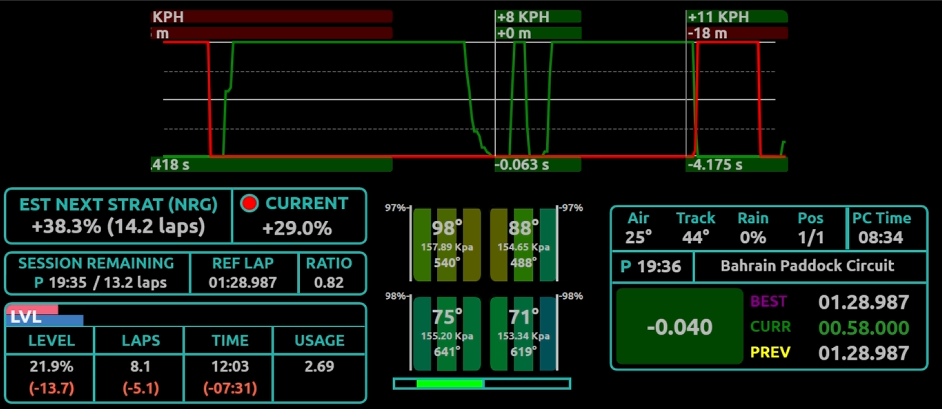
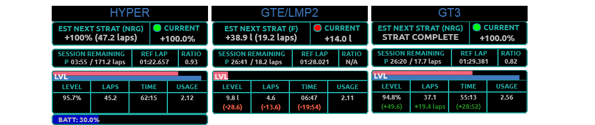
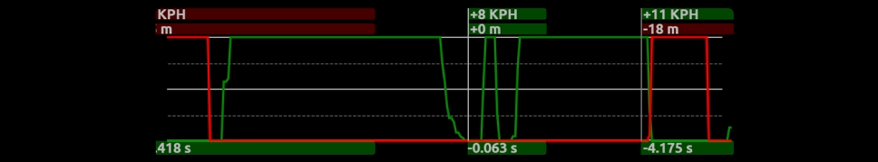
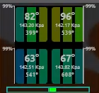
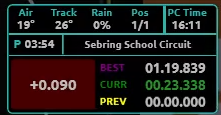

[](https://www.paypal.com/donate/?business=V4AQ5FUGX8PUW&no_recurring=1&item_name=%27...Persistent+Miediocrity+Since+Breakfast...%27&currency_code=GBP)

# MogCorp LMU Tools Bundle


The MogCorp LMU Tools Bundle is a collection of [SimHub](https://www.simhubdash.com/) tools for Le Mans Ultimate. The bundle contains the following modules:
- MogCorp CornerMajig - a customisable realtime corner analysis tool
- MogCorp StrategyThingy - a customisable realtime tyre analysis tool and pit strategy calculator
- MogCorp TyreFrippery - a tyre info display widgety thing
- MogCorp SessionInfoMaBob - minimal session information display
- [Redadeg plugin](https://github.com/tembob64/Redadeg.lmuDataPlugin) for SimHub (used to capture LMU telemetry)

This bundle is meant to be modular; you can pick and choose which elements to use, either separately or by combining elements into one Dash/overlay within SimHub. This was initially conceived as a means to produce a more functional overlay for our creaking leader, Hestor MogWitt III: a VR user in LMU.

Should these tools prove useful then MogCorp will continue development towards offering these resources via a SimHub plugin.

# Download and Install
Download the latest release [here](https://github.com/mog456/MogCorp-LMU-Tools-Bundle/releases/latest) and unzip it.

***IMPORTANT*** After unzipping make sure to copy the file Redadeg.lmuDataPlugin.dll to your SimHub installation root dir.
Usually found at: ```...\Program Files (x86)\SimHub\```

Once you have the plugin copied to the SimHub dir just double click 'MogCorp LMU Tools Bundle' in the bundle to install it in SimHub.

Launch Simhub and make sure the 'Redadeg LMU Data plugin' is enabled by going to 'Add/Remove Features' and enabling it there. If you can't see the plugin in SimHub make sure you have copied the Redadeg.lmuDataPlugin.dll to your SimHub installation root dir. 


You should now see the dashboard in SimHub's 'Dash Studio' tab and be able to launch it from there.

----
- ***TIP:*** *These tools are packaged as a SimHub dashboard but can be enabled as an overlay by clicking on the 'MORE' option on the right of the dashboard in SimHub and selecting 'Convert to overlay'. Doing this will create the overlay in the 'Overlays' Tab of SimHub.*
----

# MogCorp StrategyThingy


A live strategy display that tracks fuel/energy consumption over the previous 5 valid laps and suggests your next pit strategy. Display type (e.g. nrg/fuel etc) is automatically selected by vehicle class. Main functionality includes:

- Where remaining race time is more than current vehicle fuel/nrg capacity, output will return a 'full stint' strategy - e.g. 100% nrg/max fuel
- Where remaining race time is within the max capacity of the vehicle, output will return an estimated nrg/fuel strat based on last 5 valid laps consumption
- In cases where remaining race time is within the nrg/fuel capacity of the vehicle, output will also display live fuel/nrg, time and laps delta to race finish
- Output displays a LED indicator that indicates the difference between your selected strategy (in game) and the estimated strategy, where GREEN = within 1.0 (units fuel/nrg%), RED = under estimate, ORANGE = over estimate.
- Where race time remaining is within capacity of vehicle, the estimated strategy will also account for extra laps of nrg/fuel as defined in `MogCorpTools__settings.json`.
- Output will also display a fuel/nrg warning (red background) indicator when current levels are below thresholds in `MogCorpTools__settings.json`.

***(For details on editing the settings.json see [this more detailed breakdown](#a-modular-dash))***

 # MogCorp CornerMajig
A brake/throttle trace overlay that allows users to analyse per corner performance in realtime on a per track basis. This tool keeps track of your performance (braking distance, min speed, max speed and time in corner) on a per corner basis compared with your performance on your best lap in the current session. Using built-in per track data users can get an idea of where time is being gained/lost in each corner.



***NOTE: For more info on the trackData.json and how to edit this file see [this more detailed breakdown...](#a-note-on-trackdatajson)***

# MogCorp TyreFrippery


Its a tyre widgety thing that displays info about those tyres including:
- Temperature (IMO and overall)
- Wear (visual and numeric indicator)
- Pressures

# MogCorp SessionInfoMaBob


Displays stuff about the current session....

# Extra Info
## A modular Dash
**SETTINGS:** This bundle contains  an editable settings file that allows users to change the functionality of the tool. The settings can be found at: `../Program Files (x86)/SimHub/DashTemplates/MogCorp LMU Tools Bundle/JavascriptExtensions/Extras/Settings/MogCorpTools_settings.json`.

These settings are all explained in the file itself so should be easy to grasp. Note you can enable/disable display of any of the dash elements in 'setElementsDisplayVisibility' to true/false.

Just open that JSON up in a text editor and alter the settings to suit. Remember to save the settings file (just hit 'Save' or CTRL+S) and restart the dash for the settings to take effect.

## Layout, Editing and VR
As mentioned earlier this dash was developed specifically to help VR users and while the main dash is packaged as a minimal application but it's easy enough to scale up to use in VR. To do this:
- click on the 'More' option on the right side of the 'MogCorp LMU Tools Bundle' in SimHub DashStudio
- select 'Edit dashboard'
- to scale up the dash size go to Dashboard/Dashboard properties and change the overall scale (I used 1920 x 1024 for my VR version of this)
- you can now edit the Dash as you wish by dragging the individual elements into position.
- I added a few other tools for relatives/leaderboard/map from this great bundle on [overtake.gg](https://www.overtake.gg/downloads/rf2-lmu-ams2-simhub-mmo-modern-multiclass-overlay-standings-relative-tires-radar.74112/)

*If you're lost and need help just give me a shout)*

## A Note On trackData.json
The MogCorp CornerMajig tool relies on the .json file trackData.json found at ``.../SimHub/DashTemplates/MogCorp LMU Tools Bundle/JavascriptExtensions/Extras/Data/trackData.json"``. This file may come down to personal preference in terms of when a corner starts/ends. Editing this file (e.g. moving the 'start' of a corner backwards or moving the 'end' of a corner forward) can be done at your own discretion. Similarly some corners have been amalgamated into one - e.g. turn 1 and 2 at Bahrain) this is purely my own preference and if you wish to edit this file please feel free. What I would ask is that I am aware that some of the data contained here may be noticeably off. If you find this to be the case and you have edited the trackData please let me know so I can include any updated data in future releases.

In terms of editing the trackData.json make sure there is no corner overlap (e.g. a corner start distance SHOULD NOT BE GREATER THAN the previous corners' end distance) *AND* make sure that each data element in corners[] has an individual cornerName. There is absolutely no need for the corners to named sequentially (1, 2, 3, etc). The names are strings so you can call them what you want **AS LONG AS** each cornerName is unique.

Also, this cornerMajig tool is potentially extensible (in terms of being adapted for other sims) as it is only reliant on core SimHub telemetry data. If you have track data you wish to be included but is related to a sim other than LMU, again let me know as I'd be happy to incorporate it if you can provide me with the data (I have been using data from MoTeC).

# Acknowledgements
Huge thanks to [Redadeg plugin](https://github.com/tembob64/Redadeg.lmuDataPlugin) for allowing me to use this plugin. Awesome.

Our humble thanks also go out to all that have supported MogCorp over the last few years. Whether you realise it or not you have been a great help to us in the fumbling darkness. Especially everyone at [Bongo Racing](https://www.youtube.com/@BongoRacing). If you want to get in touch about this stuff you can reach me via the Discord you'll find at that link.

# ToDo
- If support for this project is forthcoming we will centralise all settings and trackData in a SimHub plugin.
- trackData.json only has the base LMU tracks at this point
